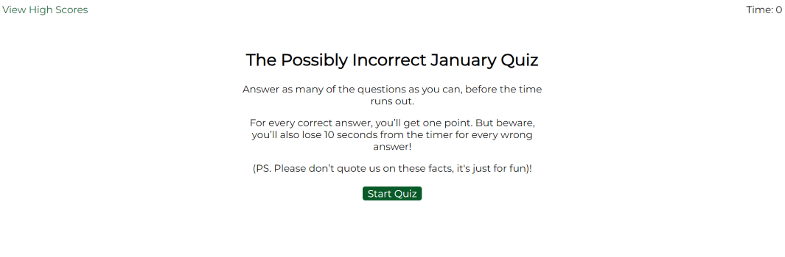
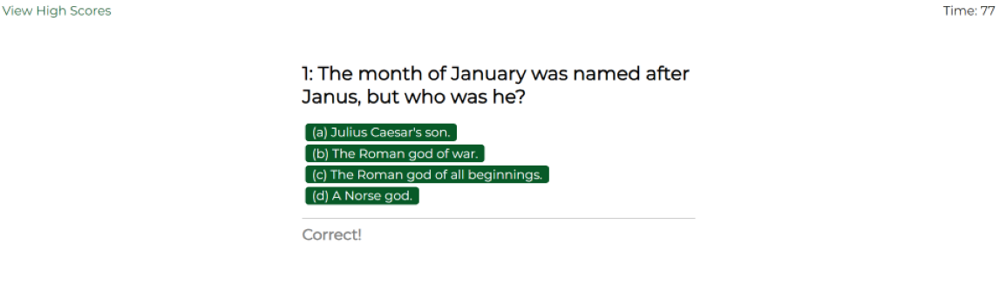
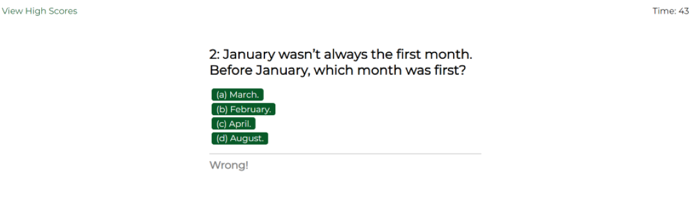
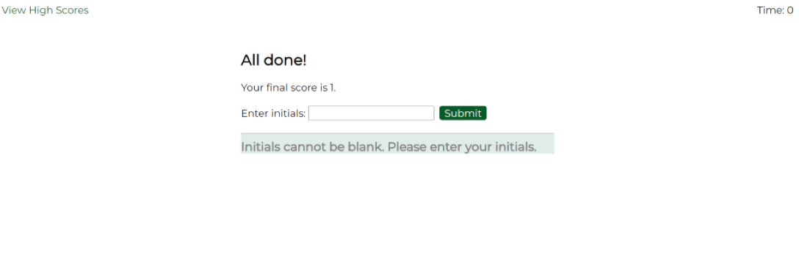
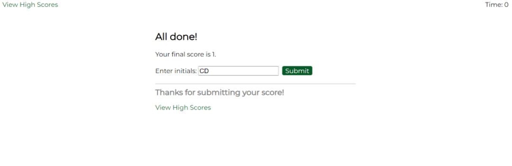

# Multiple Choice Quiz Game

## Contents

* [Description](#description)
* [Build](#build)
* [Installation](#installation)
* [Usage](#usage)
* [Demonstration shots](#demo-shots)
* [Credits](#credits)
* [License](#license)
* [Acknowledgments](#acknowledgments)
* [References](#references)

## Description

The aim of this project was to build a timed quiz with multiple-choice questions.

The project specified that the application should run in the browser and include HTML and CSS that is dynamically updated by JavaScript, as well as an interface that is ‘clean’, ‘polished’ and responsive.

The project criteria further specified that the quiz should include a start button (which generates the first question and set of answers and starts a timer), answers buttons for each question (which generate the next question and set of answers) and that when an incorrect answer is selected, 10 seconds should be deducted from the quiz timer.

When all of the questions are answered (or when the timer reaches zero), the project criteria stated that the user’s score should be displayed and the user should have the ability to save their initials and their score.

## Build

As per the project criteria, the application’s functionality has been built using Javascript.

The Javascript code has been commented throughout with pseudocode, breaking the project into tasks and sub-tasks (labelled as ‘JAVASCRIPT TASKS’).

While the starter HTML code has been largely unchanged, the CSS code has been partially updated to change the ‘look’ of the application. All changes to the starter code have been noted in the code comments.

## Installation

N/A

## Usage

Users navigate to the webpage via the URL ([January Quiz](https://code0em.github.io/mcq-quiz-game/)). When on the start page, the title of the quiz and an explanation of how to play the quiz is displayed. A timer (defaulted to zero) is displayed in the top right of the page, while a link to the High Scores webpage is located in the top left of the page. A button to start the quiz is positioned below the quiz title and explanation.

Upon selecting the start button, the quiz timer starts and the user is presented with the first question and four possible answer buttons. If an incorrect answer is selected, an ‘incorrect’ sound is played and a ‘wrong’ message is displayed. The timer in the top right of the page is also decreased by 10 seconds. If a correct answer is selected, a ‘correct’ sound is played and a ‘correct’ message is displayed. One point is also added to the user’s score (but this is not displayed). Half a second after selecting an answer button, the next question and four possible answer buttons are displayed on the page.

The above process is repeated until all of the questions have been answered (or is ended earlier if the timer reaches zero).

When all of the questions have been answered (or when the timer reaches zero), the end page is displayed with a title and the user’s score. An input field and submit button is displayed below the title, inviting the user to save their score and initials.

If the user submits initials of more than three characters or leaves this field blank, an error message is displayed. When the user submits acceptable initials, a message confirming their submission and a link to the High Scores webpage are displayed underneath.

On the High Scores webpage, existing users’ scores and initials are displayed in a numbered list (ordered from highest to lowest scores). If no existing scores have been saved, this list is not displayed. This page also includes two buttons: Go Back and Clear High Scores. The former button returns the user to the quiz start page, while the latter clears the saved scores from the browser and removes the existing scores from the page.

## Demonstration shots

On a resolution of 1400px, the application will display the as follows:

### Start page

### Question page (correct question)

### Question page (incorrect question)

### End page (error message)

### End page (confirm message)

### High Score page

## Credits

Credit given to edX (2023) for providing the starter code and to Google Fonts (no date) for the font used throughout the application.

Credit also given to MDN Web Docs (no date) (among others), whose various pages built upon the developer’s existing knowledge of the Javascript methods used throughout the build (credits also cited in code comments and referenced below).

Credit given to Britannica (2023) and Medium (2023) which were used to create the quiz questions. (Note: in the current iteration of the project, the quiz topic is the month of January).

## License

Distributed under the MIT License. See `LICENSE.txt` for more information.

## Acknowledgments

Code written by Code0Em ([email](mailto:code.em@outlook.com)/ [GitHub](https://github.com/Code0Em)).

## References

edX (2023) [*Build new skills. Advance your career*](https://www.edx.org/).

bobbyhadz (2023) [*Check if a key exists in localStorage using JavaScript*](https://bobbyhadz.com/blog/check-if-localstorage-key-exists-using-javascript).

Britannica (2023) [*January | Meaning & Facts*](https://www.britannica.com/topic/January).

byby.dev (2023) [*How to sort by object property in JavaScript*](https://byby.dev/js-sort-by-object-property).

Codingflag (2020) [*Everything you need to know about JSON.stringify() and JSON.parse()*](https://www.youtube.com/watch?v=OfRGJF3dT0o).

Decoding Web Development (no date) [*How to check if an element exists in JavaScript*](https://www.decodingweb.dev/javascript-check-if-element-exists).

Google Fonts (no date) [*Montserrat*](https://fonts.google.com/specimen/Montserrat/about).

JS Curious (2022) [*Play audio with HTMLAudioElement API in JavaScript*](https://jscurious.com/play-audio-with-htmlaudioelement-api-in-javascript/).

[MDN Web Docs](https://developer.mozilla.org/en-US/) (no date) (numerous pages accessed).

Medium (2023) [*14 Fun Facts About January. New Year, New You. Are we right?*](https://medium.com/@drakewenston900/14-fun-facts-about-january-d95d8903945c).

Stack Overflow (2014) [*Is there a way to make numbers in an ordered list bold?*](https://stackoverflow.com/questions/21369843/is-there-a-way-to-make-numbers-in-an-ordered-list-bold).

W3Schools (no date) [*CSS Google Fonts*](https://www.w3schools.com/css/css_font_google.asp).

